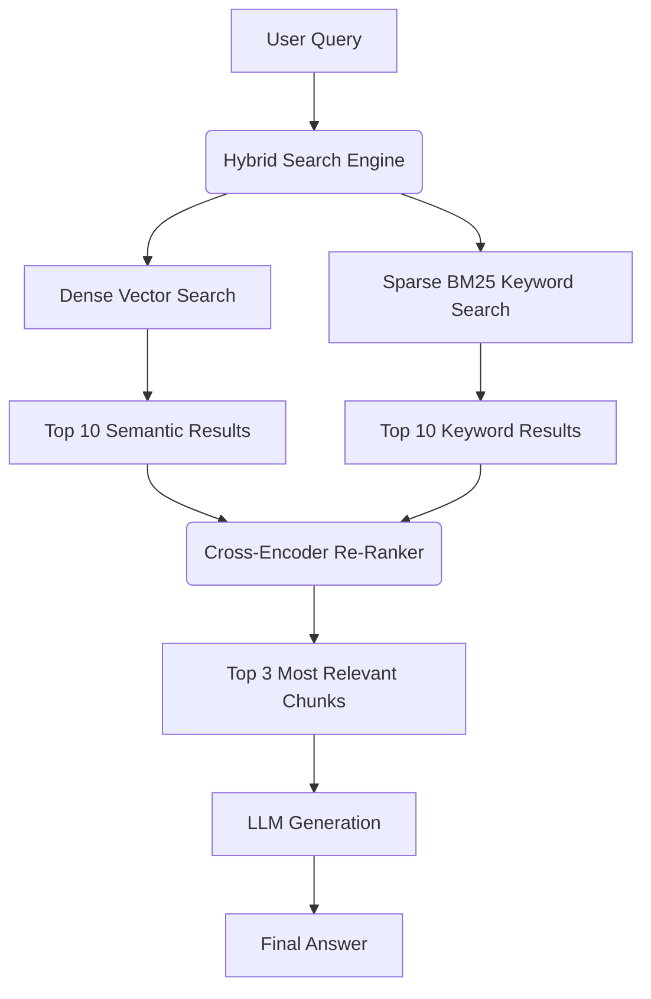

# Learning Objective
By the end of this lesson, you will understand how to scale standard Retrieval-Augmented Generation (RAG) into a production-ready system using advanced chunking strategies, hybrid search, and cross-encoder re-ranking.

---

## 1. Simple Explanation

Imagine you are in a massive library looking for a specific answer. 
Standard RAG is like asking a librarian to grab 5 books that *sound* like they have the answer. Sometimes, they bring back books with the right title but wrong information.
**Advanced RAG** is like having a team of experts: one expert reads the books deeply (Vector Search), one expert looks for exact keywords in the index (Keyword Search), and a head librarian carefully sorts the results to hand you the absolute best answer (Re-ranking).

---

## 2. Professional Explanation

Standard Retrieval-Augmented Generation typically relies solely on **Dense Vector Retrieval** (semantic search). While powerful, it struggles with exact keyword matching (e.g., searching for a specific product ID like "AB-1234"). 

**Advanced RAG** solves this by implementing a **Hybrid Search Pipeline**:
1. **Semantic Search (Dense):** Uses embeddings to understand meaning and context.
2. **Keyword Search (Sparse/BM25):** Uses traditional inverted indices for exact keyword matches.
3. **Re-ranking (Cross-Encoders):** A secondary ML model evaluates the retrieved chunks and scores their exact relevance to the user's prompt, filtering out noise.

---

## 3. Real-world Example

**Enterprise Customer Support Bot:**
A user asks: *"Why is my iPhone 15 Pro Max overheating when I use the Safari browser on iOS 17.2?"*
- **Standard RAG** might retrieve articles about iPads overheating, or general Safari issues, because the semantic meaning is "Apple device overheating."
- **Advanced RAG** uses BM25 to lock onto the exact keywords (`iPhone 15 Pro Max`, `iOS 17.2`) while using Semantic Search to understand "overheating". The Re-ranker then ensures the final retrieved document perfectly aligns with both constraints before generating an answer.

---

## 4. Visual Explanation

---

## 5. Practice & Challenge

**The Chunking Challenge**
Instead of splitting documents strictly by character count, try splitting them by **semantic boundaries** (like markdown headers).

  
// Standard RecursiveCharacterTextSplitter

  

    chunk_size = 1000 
    chunk_overlap = 200
  

  
// Advanced MarkdownHeaderTextSplitter

  

    headers_to_split_on = [ 
    &nbsp;&nbsp;("#", "Header 1"), 
    &nbsp;&nbsp;("##", "Header 2") 
    ]
  

---

## 6. Knowledge Check

<QuizWidget 
  question="Why is Hybrid Search generally superior to pure Semantic Search in production RAG systems?"
  options={[
    "It is faster and uses less compute power.",
    "It combines exact keyword matching with contextual understanding.",
    "It doesn't require an embedding model.",
    "It completely eliminates AI hallucinations."
  ]}
  answer="It combines exact keyword matching with contextual understanding."
  explanation="Hybrid search leverages both BM25 (for precise keyword hits like product numbers) and Dense Vectors (for semantic meaning), providing the best of both worlds before re-ranking."
/>

---

## 7. Interview Question

**Q: How would you handle a RAG system that is retrieving irrelevant but semantically similar documents?**
*Answer:* I would implement a Re-ranking step using a Cross-Encoder (like Cohere Re-rank or BGE-Reranker). The retriever fetches a larger pool of documents (e.g., top 20), and the re-ranker heavily scrutinizes the relationship between the prompt and each document to select the final top 3 for the LLM context window.

---

## 8. Summary
- **Standard RAG** relies on basic vector search.
- **Advanced RAG** introduces Hybrid Search (BM25 + Vectors).
- **Re-ranking** is essential to filter out noise and improve LLM accuracy.
- **Chunking strategies** should be semantic, not just character-based.

---

