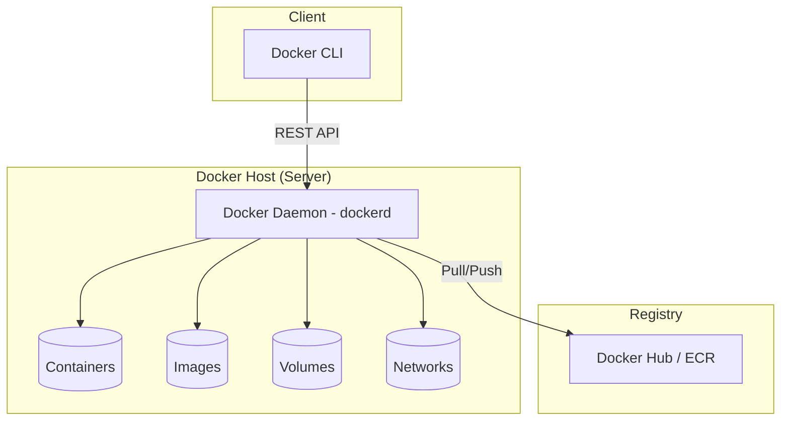

## 🐳 What is Docker?

Docker is an open-source platform that allows developers to package applications and their dependencies into standardized units called **Containers**. 

Before Docker, deploying software was a nightmare. Developers would say, *"It works on my machine!"*, but when the code was pushed to a production server, it would crash because of different OS versions, missing libraries, or conflicting database versions. 

Docker solves this by wrapping the code, runtime, system tools, and libraries into a single, portable executable. 

### Docker vs. Virtual Machines (VMs)

While both provide isolation, their architectures are fundamentally different.

<div className="overflow-x-auto my-8">
  <table className="w-full text-sm text-left">
    <thead className="bg-white/10 text-white">
      <tr>
        <th className="px-4 py-3 border border-white/10">Feature</th>
        <th className="px-4 py-3 border border-white/10 text-primary">Docker Containers</th>
        <th className="px-4 py-3 border border-white/10">Virtual Machines (VMs)</th>
      </tr>
    </thead>
    <tbody className="text-textSecondary">
      <tr>
        <td className="px-4 py-3 border border-white/10 font-bold text-white">Architecture</td>
        <td className="px-4 py-3 border border-white/10">Shares the Host OS Kernel. Lightweight.</td>
        <td className="px-4 py-3 border border-white/10">Requires a full Guest OS per VM. Heavyweight.</td>
      </tr>
      <tr>
        <td className="px-4 py-3 border border-white/10 font-bold text-white">Startup Time</td>
        <td className="px-4 py-3 border border-white/10">Milliseconds (Instant)</td>
        <td className="px-4 py-3 border border-white/10">Minutes (Booting an OS)</td>
      </tr>
      <tr>
        <td className="px-4 py-3 border border-white/10 font-bold text-white">Resource Usage</td>
        <td className="px-4 py-3 border border-white/10">Megabytes (Highly efficient)</td>
        <td className="px-4 py-3 border border-white/10">Gigabytes (Inflexible allocation)</td>
      </tr>
    </tbody>
  </table>
</div>

---

## 🧠 Docker Internal Working & Architecture

Docker uses a **Client-Server architecture**. 



### Core Linux Technologies
Docker isn't magic; it's a wrapper around powerful Linux kernel features:
1. **Namespaces:** Provides *Isolation*. It restricts what a container can see (Process IDs, Networks, Mounts). This is why a container thinks it is running on a dedicated machine.
2. **cGroups (Control Groups):** Provides *Resource Limiting*. It restricts how much CPU, Memory, and Disk I/O a container can use so it doesn't starve the host OS.
3. **Union File System (UnionFS):** Provides *Layering*. Images are built in layers. If multiple images share the same base layer (like Ubuntu), Docker only stores it once on disk, saving massive amounts of space.

---

## 📦 The Docker Workflow

Here is how code travels from your laptop to a running container:

1. **Dockerfile**: A plain text file containing instructions to build an image.
2. **Docker Image**: The built, read-only template containing your code and dependencies.
3. **Docker Container**: A running instance of a Docker Image.
4. **Docker Registry**: A remote storage hub (like Docker Hub or AWS ECR) where you upload images to share with servers.

---

## 📜 The Dockerfile Deep Dive

A `Dockerfile` is the blueprint. Let's look at every critical instruction:

```dockerfile
# 1. FROM: Defines the base image. Always use specific versions (tags), never 'latest'.
FROM node:20-alpine AS builder

# 2. WORKDIR: Sets the working directory inside the container.
WORKDIR /app

# 3. ARG: Build-time variables. Not available when the container is running.
ARG NODE_ENV=production

# 4. ENV: Runtime environment variables.
ENV PORT=3000

# 5. COPY: Copies files from your host computer into the container.
# We copy package.json first to leverage Docker's Build Cache.
COPY package*.json ./

# 6. RUN: Executes a command during the IMAGE BUILD process.
RUN npm ci --only=production

# Copy the rest of the application code
COPY . .

# 7. EXPOSE: Documents which port the container listens on (does not actually publish it).
EXPOSE 3000

# 8. USER: Drops root privileges for security.
USER node

# 9. HEALTHCHECK: Tells Docker how to test if the app is still alive.
HEALTHCHECK --interval=30s --timeout=3s \
  CMD wget --quiet --tries=1 --spider http://localhost:3000/health || exit 1

# 10. CMD: The default command executed when the container STARTS.
CMD ["node", "server.js"]
```

> [!TIP]
> **CMD vs ENTRYPOINT:** `CMD` is easily overridden by passing a command to `docker run`. `ENTRYPOINT` is strict and forces the container to run as a specific executable, appending the `docker run` arguments to it.

---

## 💻 Essential Docker Commands

Master these CLI commands to navigate your containers efficiently:

### Image Management
- `docker build -t myapp:1.0 .` : Builds an image from a Dockerfile in the current directory (`.`).
- `docker image ls` : Lists all local images.
- `docker rmi <image_id>` : Deletes an image.
- `docker system prune -a` : 🛑 Cleans up unused images, stopped containers, and networks. Use carefully!

### Container Lifecycle
- `docker run -d -p 8080:3000 --name web myapp:1.0` : Runs a container in detached mode (`-d`), mapping host port 8080 to container port 3000.
- `docker ps` : Lists running containers. (`-a` for all containers).
- `docker stop web` : Gracefully stops the container.
- `docker rm -f web` : Forcefully stops and removes the container.

### Debugging
- `docker logs -f web` : Streams the logs of the container in real-time.
- `docker exec -it web sh` : Opens an interactive shell *inside* the running container.
- `docker inspect web` : Returns detailed JSON metadata about the container (IP addresses, mounts, etc).

---

## 🚀 Docker in Node.js (Real-world Implementation)

Let's Dockerize a Node.js API with a Postgres database using **Docker Compose**.

`docker-compose.yml` allows you to define and run multi-container applications using a single YAML file.

```yaml
version: '3.8'

services:
  # 1. The Express API
  api:
    build: .
    ports:
      - "3000:3000"
    environment:
      - DATABASE_URL=postgres://user:password@db:5432/myapp
    depends_on:
      db:
        condition: service_healthy
    networks:
      - app-network

  # 2. The PostgreSQL Database
  db:
    image: postgres:15-alpine
    environment:
      POSTGRES_USER: user
      POSTGRES_PASSWORD: password
      POSTGRES_DB: myapp
    ports:
      - "5432:5432"
    volumes:
      - pgdata:/var/lib/postgresql/data
    networks:
      - app-network
    healthcheck:
      test: ["CMD-SHELL", "pg_isready -U user -d myapp"]
      interval: 10s
      timeout: 5s
      retries: 5

# Define Persistent Storage
volumes:
  pgdata:

# Define an isolated network
networks:
  app-network:
    driver: bridge
```

Run `docker-compose up -d` and your entire stack spins up instantly! The API can connect to the database using the hostname `db` because Docker automatically handles DNS resolution within the `app-network`.

---

## 🌐 Advanced Networking & Volumes

### Networking Drivers
1. **Bridge (Default):** Isolated network inside the host. Containers can talk to each other via IP/Hostname. Port mapping is required for outside access.
2. **Host:** Removes isolation. The container uses the host machine's network stack directly. Highly performant, but less secure.
3. **None:** Complete network isolation. No internet access.

### Volumes (Storage)
Containers are ephemeral. If a container dies, all data inside it is wiped.
- **Named Volumes:** Managed by Docker. Best for database persistence (like the `pgdata` volume above).
- **Bind Mounts:** Mounts a specific folder on your host machine directly into the container. Excellent for local development (e.g., mapping your `./src` code folder so nodemon can hot-reload without rebuilding the image).

---

## 🔒 Security Best Practices

> [!CAUTION]
> A compromised container can sometimes lead to a compromised host (container escape). Secure your images!

1. **Never run as root:** Always create a non-root `USER` in your Dockerfile.
2. **Use minimal base images:** Use `alpine`, `distroless`, or `-slim` images. Fewer utilities = smaller attack surface.
3. **Scan images for vulnerabilities:** Use tools like `docker scout cves` or Trivy to scan images before deployment.
4. **Don't bake secrets into images:** Never put API keys in a Dockerfile `ENV`. Pass them at runtime, or use Docker Swarm/Kubernetes Secrets.
5. **Use Read-Only filesystems:** Run containers with `--read-only` to prevent attackers from writing malware to the container's disk.

---

## 📝 Knowledge Check

<Quiz 
  question="Which Dockerfile command runs during the IMAGE BUILD process, rather than when the container actually starts?"
  options={["CMD", "ENTRYPOINT", "RUN", "START"]}
  answer="RUN"
/>

<Quiz 
  question="Why is it highly recommended to use a Named Volume for a PostgreSQL database container?"
  options={["To make the database run faster", "To ensure database data persists even if the container is destroyed", "To expose the database to the internet", "To reduce the CPU usage of the container"]}
  answer="To ensure database data persists even if the container is destroyed"
/>
