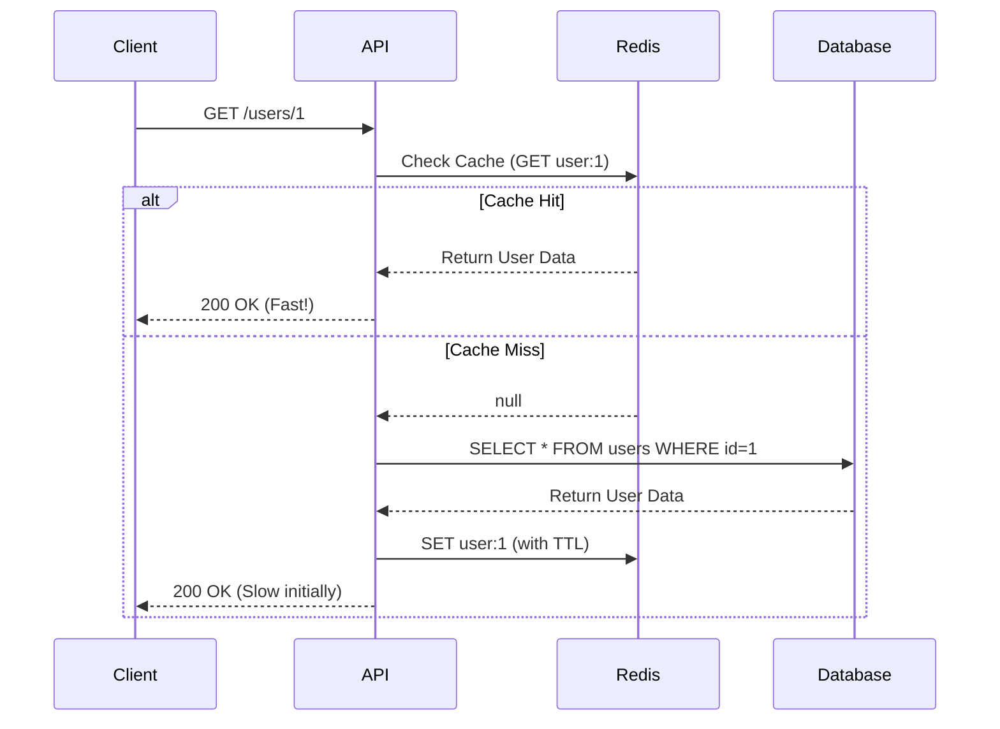

## ⚡ What is Redis?

**Redis (Remote Dictionary Server)** is an open-source, in-memory, key-value data store. It is universally recognized as the fastest database in the world.

While traditional databases (like PostgreSQL or MongoDB) store data on a hard drive (SSD/HDD), Redis stores all its data directly in **RAM**. RAM is orders of magnitude faster than a hard drive, allowing Redis to easily handle millions of reads and writes per second with sub-millisecond latency.

### Redis vs. Traditional Databases

<div className="overflow-x-auto my-8">
  <table className="w-full text-sm text-left">
    <thead className="bg-white/10 text-white">
      <tr>
        <th className="px-4 py-3 border border-white/10">Feature</th>
        <th className="px-4 py-3 border border-white/10 text-primary">Redis</th>
        <th className="px-4 py-3 border border-white/10">PostgreSQL / MongoDB</th>
      </tr>
    </thead>
    <tbody className="text-textSecondary">
      <tr>
        <td className="px-4 py-3 border border-white/10 font-bold text-white">Storage Medium</td>
        <td className="px-4 py-3 border border-white/10">In-Memory (RAM)</td>
        <td className="px-4 py-3 border border-white/10">Disk (SSD/HDD)</td>
      </tr>
      <tr>
        <td className="px-4 py-3 border border-white/10 font-bold text-white">Latency</td>
        <td className="px-4 py-3 border border-white/10">&lt; 1 Millisecond</td>
        <td className="px-4 py-3 border border-white/10">10-100 Milliseconds</td>
      </tr>
      <tr>
        <td className="px-4 py-3 border border-white/10 font-bold text-white">Data Model</td>
        <td className="px-4 py-3 border border-white/10">Key-Value Data Structures</td>
        <td className="px-4 py-3 border border-white/10">Relational / Document</td>
      </tr>
      <tr>
        <td className="px-4 py-3 border border-white/10 font-bold text-white">Primary Use Case</td>
        <td className="px-4 py-3 border border-white/10">Caching, Queues, Pub/Sub, Real-time</td>
        <td className="px-4 py-3 border border-white/10">Primary Source of Truth, ACID</td>
      </tr>
    </tbody>
  </table>
</div>

---

## 🧠 Internal Working & Persistence

Because Redis lives in RAM, what happens if the server crashes or loses power? Doesn't all the data get wiped out? 

Yes, RAM is volatile. But Redis implements **Persistence** to save data to the disk in the background, ensuring data durability.

### Persistence Mechanisms
1. **RDB (Redis Database Snapshots):** Redis takes a snapshot of your dataset at specified intervals (e.g., every 5 minutes) and saves it as a `.rdb` binary file. It's highly compact and great for backups, but if Redis crashes, you lose all data written since the last snapshot.
2. **AOF (Append Only File):** Redis logs *every single write operation* to an append-only file. If it crashes, it just replays the log to reconstruct the exact state. It's much safer, but the file size can grow massive and slow down restarts.

> [!TIP]
> In production, you typically enable **both**. RDB provides fast restarts and easy backups, while AOF provides strict data safety.

---

## 📚 Core Data Structures & Commands

Redis isn't just basic strings. It supports advanced, highly-optimized data structures.

### 1. Strings
The most basic type. Can hold text, serialized JSON, or integers.
- `SET user:1 "John"` : Sets the key.
- `GET user:1` : Retrieves the key.
- `INCR page_views` : Atomically increments a number (perfect for rate limiting and view counters).

### 2. Hashes
Think of Hashes as JSON objects or Maps. Great for storing user profiles.
- `HSET user:100 name "Alice" age 25` : Sets fields in a hash.
- `HGETALL user:100` : Returns all fields and values.

### 3. Lists
Linked lists. You can push or pop from the left (head) or right (tail). Great for message queues or feeds.
- `LPUSH tasks "Email"` : Pushes to the left.
- `RPUSH tasks "Invoice"` : Pushes to the right.
- `LPOP tasks` : Removes and returns the first element.

### 4. Sets
Unordered collections of *unique* strings. Great for tags or tracking unique IP addresses.
- `SADD online_users "john"` : Adds to set.
- `SISMEMBER online_users "john"` : Checks if it exists (O(1) time complexity).

### 5. Sorted Sets (Z-Sets)
Sets where every element is tied to a **score**. Redis keeps them perfectly sorted by score automatically. Extremely powerful for **Leaderboards**.
- `ZADD game_scores 500 "john"` : Adds john with a score of 500.
- `ZADD game_scores 1000 "alice"` : Adds alice.
- `ZREVRANGE game_scores 0 -1 WITHSCORES` : Returns the leaderboard from highest to lowest.

### Expiration (TTL)
- `EXPIRE user_session:xyz 3600` : Deletes the key automatically after 3600 seconds. Crucial for sessions and caching.

---

## 🚀 Redis Caching Strategies

When acting as a cache, Redis sits in front of your slow database to intercept requests.



### The "Cache Aside" Pattern (Shown above)
This is the most common pattern. The application code is responsible for checking the cache, falling back to the database, and writing to the cache.

### Cache Invalidation (The hardest problem in computer science)
When data changes in PostgreSQL, the cached copy in Redis becomes *stale*. 
- **Time-to-Live (TTL):** Set an `EXPIRE`. The cache self-destructs eventually. Simple, but users might see old data for a while.
- **Event-Driven Write-Through:** Whenever your API updates a user in PostgreSQL, *immediately* run a `DEL user:1` or `SET user:1 <new_data>` to keep Redis in sync.

---

## 💻 Redis in Node.js (Real-world Implementation)

Let's use the powerful `ioredis` library to implement a robust caching layer in Express.js.

```javascript
import express from "express";
import Redis from "ioredis";
import { db } from "./db.js";

const app = express();

// 1. Connect to Redis
const redis = new Redis(process.env.REDIS_URL); // e.g., redis://localhost:6379

// 2. Cache Middleware
app.get("/api/users/:id", async (req, res) => {
  const { id } = req.params;
  const cacheKey = `user:${id}`;

  try {
    // 3. Try to fetch from Redis
    const cachedData = await redis.get(cacheKey);

    if (cachedData) {
      // CACHE HIT - Return immediately
      return res.json({ source: "cache", data: JSON.parse(cachedData) });
    }

    // 4. CACHE MISS - Query the slow database
    const user = await db.query("SELECT * FROM users WHERE id = $1", [id]);
    
    if (!user) return res.status(404).json({ error: "Not found" });

    // 5. Store in Redis for future requests (Expire in 1 hour)
    await redis.set(cacheKey, JSON.stringify(user), "EX", 3600);

    res.json({ source: "database", data: user });

  } catch (error) {
    res.status(500).json({ error: "Server Error" });
  }
});
```

---

## 📡 Redis Pub/Sub & Streams

Redis isn't just a database; it's a real-time messaging broker.

### Pub/Sub (Publish & Subscribe)
Perfect for chat applications or real-time notifications. It is a "fire and forget" system. If a subscriber isn't listening when a message is published, that message is gone forever.
- `SUBSCRIBE chat_room_1` : Opens a listening connection.
- `PUBLISH chat_room_1 "Hello World"` : Broadcasts to all active listeners.

### Redis Streams
Introduced specifically to fix Pub/Sub's "fire and forget" flaw. Streams act like an append-only log (similar to Apache Kafka). Consumers can read messages at their own pace, acknowledge them, and even read past messages they missed while disconnected.

---

## 🏰 Production Deployment & High Availability

Running a single Redis node is risky. If it crashes, your entire cache/queue goes down.

1. **Redis Replication (Master-Replica):** You have one Master node handling all writes, and multiple Replica nodes handling reads. Data syncs asynchronously.
2. **Redis Sentinel:** Monitors your Master-Replica setup. If the Master dies, Sentinel automatically promotes a Replica to become the new Master, ensuring zero downtime (High Availability).
3. **Redis Cluster:** Shards your data across multiple servers. If you have 500GB of cache, you split it across five 100GB servers. Required for massive horizontal scaling.

---

## 📝 Knowledge Check

<Quiz 
  question="Which Redis data structure is automatically sorted by a score and is perfectly designed for building gaming Leaderboards?"
  options={["Sets", "Hashes", "Lists", "Sorted Sets"]}
  answer="Sorted Sets"
/>

<Quiz 
  question="What happens in Redis Pub/Sub if a subscriber momentarily disconnects while a message is being published?"
  options={["The message is stored in memory until they reconnect", "The message is lost forever", "The message is saved to the disk", "Redis throws an error"]}
  answer="The message is lost forever"
/>
